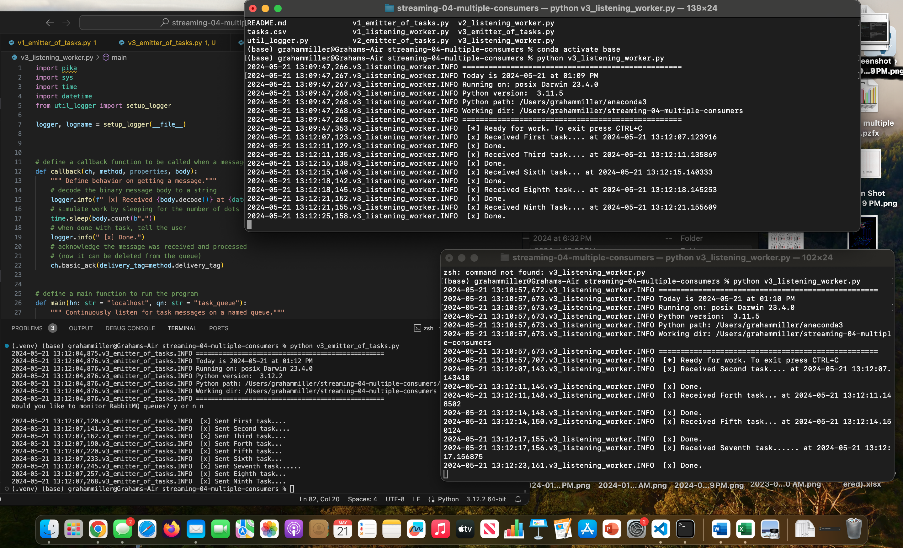

# streaming-04-multiple-consumers

### Name: Graham Miller
### Date: 05/21/2024
### Link to Repo: https://github.com/gmill88/streaming-04-multiple-consumers

> Use RabbitMQ to distribute tasks to multiple workers

One process will create task messages. Multiple worker processes will share the work. 


## Before You Begin

1. Fork this starter repo into your GitHub.
1. Clone your repo down to your machine.
1. View / Command Palette - then Python: Select Interpreter
1. Select your conda environment. 


## Read

1. Read the [RabbitMQ Tutorial - Work Queues](https://www.rabbitmq.com/tutorials/tutorial-two-python.html)
1. Read the code and comments in this repo.

## Create A Virtual Environment 
1. Open a terminal window in VS Code.
1. Use the built-in Python utility venv to create a new virtual environment named `.venv` in the current directory.

```shell
python3 -m venv .venv
```

Verify you get a new .venv directory in your project. 
We use .venv as the name to keep it away from our project files. 

## Activate the Virtual Environment

In the same VS Code terminal window, activate the virtual environment.

- On Linux/MacOS, run: `source .venv/bin/activate`

Verify you see the virtual environment name (.venv) in your terminal prompt.

## Start RabbitMQ Server

On a mac terminal, start the RabbitMQ server.

- On MacOS, run `brew services start rabbitmq`
 

## RabbitMQ Admin 

RabbitMQ comes with an admin panel. When you run the task emitter, reply y to open it. 

(Python makes it easy to open a web page - see the code to learn how.)


## Execute a Consumer / Worker

1. Run the different versions of the listening_worker.py in a seperate terminal 

1. For version 3, activate two serperate local terminals, the directions to open two consumer terminals are as follows:
- open two seperate terminals on the local machine
- use `cd /Users/grahammiller/streaming-04-multiple-consumers`, or wherever your consumer terminals are located on your machine
- run `ls`in the terminal to see a list of all the files within this folder
- run `conda activate base` to activate the base environment
- run code `python v3_listening_worker.py`, or whatever your consumer/worker is named in both terminals. Now both terminals are listening for messages. 

## Execute the Producer

1. Run the different emitter_of_tasks.py in the VS Code terminal
- Open the terminal in VS Code and run `python v3_emitter_of_tasks.py` to send the tasks to the RabbitMQ queue


## Reference

- [RabbitMQ Tutorial - Work Queues](https://www.rabbitmq.com/tutorials/tutorial-two-python.html)


## Screenshot

See a running example with at least 3 concurrent process windows here:

